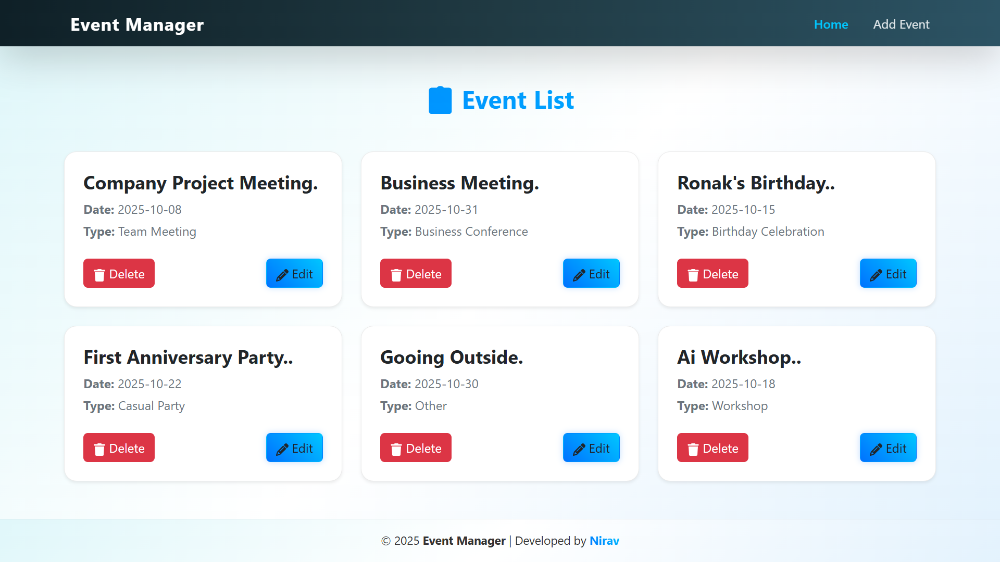
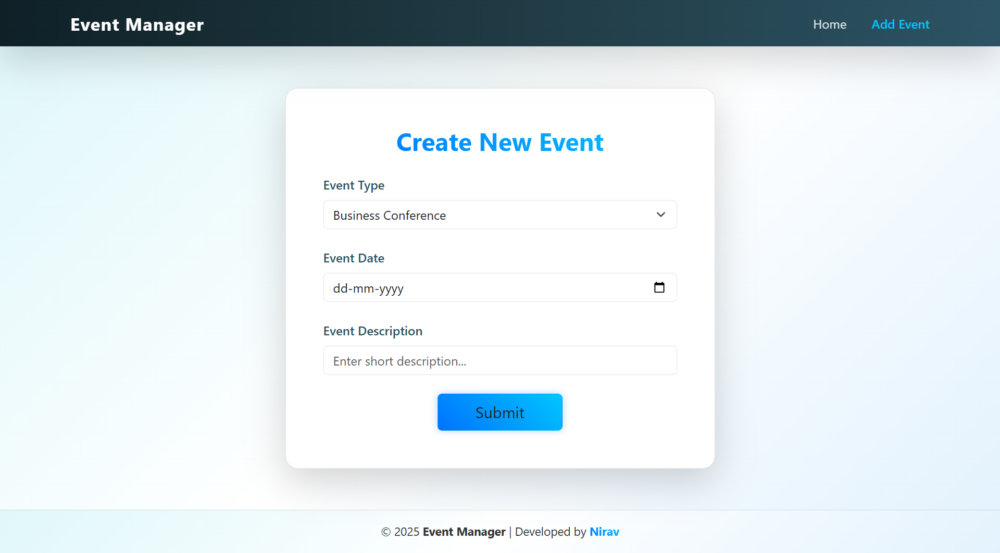

# ✅ Event Manager App  

This project is a **Multi-Page Event Management Application** built using **React**, **Redux Toolkit**, and **Bootstrap**, with **Firebase Firestore** for data storage.  
Users can **add, view, update, and delete events** categorized under different types like Business, Social, or Casual.  
The app features a **modern, minimal UI** with responsive design, gradient themes, and smooth navigation.  

---

## 🚀 Features  

* Add new events with **type, date, and description**  
* View all events as clean, organized **cards** on the Home page  
* Update or delete events instantly  
* **Separate pages** for adding an event and viewing all events  
* Fully connected with **Firebase Firestore** for real-time CRUD operations  
* Responsive layout built with **Bootstrap**  

---

## 🛠️ Tech Stack  

    
  <b>React</b> — Component-based frontend library for building UI  
    

    
  <b>Redux Toolkit</b> — Simplified state management and async operations  
    

    
  <b>Firebase Firestore</b> — Cloud-based database for storing and syncing events in real time  
    

    
  <b>Bootstrap</b> — CSS framework for responsive layouts  
    

    
  <b>CSS3</b> — Styling and layout with custom modern design  

---

## 📸 Project Preview  

### 🏠 Home Page  

### ➕ Add Event Page  
  

---

💡 **Developed by Nirav** | Powered by **React + Firebase Firestore** 🚀
